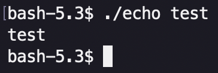
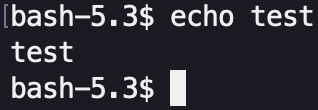
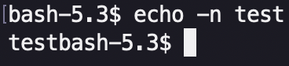

# CunEcho

*CunEcho* is the `echo` command but created by me 👨‍🔧.

*(Yes the name means "It's an echo" but in french 🇫🇷)*

The `main.c` is **23 lines** longs VS **33 lines** for `echo.c` (*the real one*)

### Example

| CunEcho    | Echo      |
| ------------- | ------------- |
|  |  |
|  |  |

### How to use it ?

It's kind of simple you just need to get `gcc` and run one command *(if you didn't already have it)*

#### With `Makefile`:

You can if you want, create the executable your self. For this you need to execute those commands: 

```bash
git clone https://github.com/squach90/CunEcho.git
cd CunEcho
make
```
And run it with:
```bash
./echo sometext
```
---

#### With `./echo` (The simplest):

```bash
git clone https://github.com/squach90/CunEcho.git
cd CunEcho
./echo sometext
```

**And boom! you can use this useless tools ! 🫠**

## Dependencies

- **Standard C** – `stdio.h`, `string.h`
- **Echo** - [Netbsd Echo](https://cvsweb.netbsd.org/bsdweb.cgi/src/bin/echo/echo.c?rev=1.23;content-type=text%2Fplain)

> Anyone is free to copy, modify, publish, use, compile, sell, or distribute this software, either in source code form or as a compiled binary, for any purpose, commercial or non-commercial, and by any means.